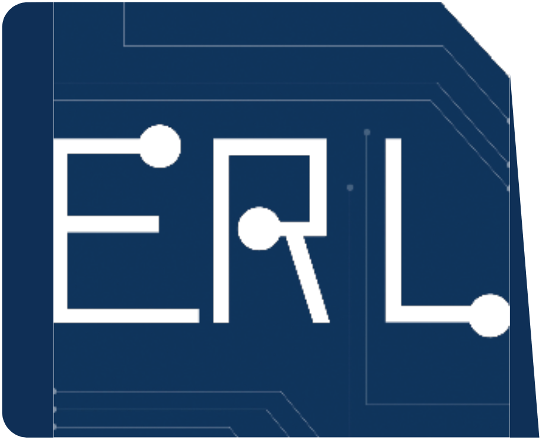
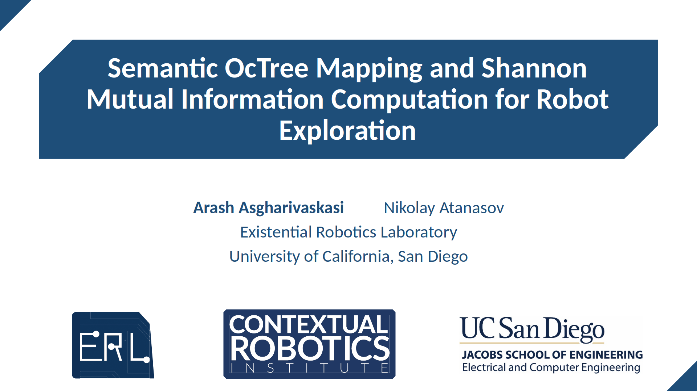

<div align="center">
  <a href="http://erl.ucsd.edu/">
    
  </a>
  <a href="https://contextualrobotics.ucsd.edu/">
    
  </a>
  <a href="https://ucsd.edu/">
    
  </a>
</div>

# Semantic Shannon Mutual Information (SSMI)

SSMI is a library for autonomous robot exploration using a stream of depth and semantic segmentation images as the input to build a semantically annotated OctoMap in real-time.

SSMI is implemented as two ROS packages, which can be built on x86-64 and ARM-based processors:
- Semantic OctoMap implementation for building probabilistic multi-class maps of an environment ([SSMI-Mapping](https://github.com/ExistentialRobotics/SSMI/tree/master/SSMI-Mapping))
- Autonomous exploration using Semantic Shannon Mutual Information ([SSMI-Planning](https://github.com/ExistentialRobotics/SSMI/tree/master/SSMI-Planning))

<p align="center">
    <a href="https://www.youtube.com/embed/KosSp3znqFo">
    
    </a>
</p>


## Gazebo Demonstration

Please check [https://github.com/ExistentialRobotics/SSMI-Example](https://github.com/ExistentialRobotics/SSMI-example) for a Gazebo demo of SSMI.

## Citation

If you found this work useful, we would appreciate if you could cite our work:

- [1] A. Asgharivaskasi, N. Atanasov. [**Active Bayesian Multi-class Mapping from Range and Semantic Segmentation Observations**](https://ieeexplore.ieee.org/document/9561711). IEEE Int. Conf. on Robotics and Automation (ICRA), 2021.

```bibtex
@InProceedings{Asgharivaskasi-ICRA21,
  author={Asgharivaskasi, Arash and Atanasov, Nikolay},
  booktitle={IEEE International Conference on Robotics and Automation (ICRA)}, 
  title={Active Bayesian Multi-class Mapping from Range and Semantic Segmentation Observations}, 
  year={2021},
  pages={1-7}
```

- [2] A. Asgharivaskasi, N. Atanasov. [**Semantic OcTree Mapping and Shannon Mutual Information Computation for Robot Exploration**](https://ieeexplore.ieee.org/abstract/document/10057106/). IEEE Transactions on Robotics (TRO), 2023.
 
 ```bibtex
@article{asgharivaskasi2023semantic,
  title={Semantic octree mapping and {S}hannon mutual information computation for robot exploration},
  author={Asgharivaskasi, Arash and Atanasov, Nikolay},
  journal={IEEE Transactions on Robotics},
  year={2023},
  publisher={IEEE}
}
```

## Acknowledgments

We gratefully acknowledge support from ARL [DCIST](https://www.dcist.org/) CRA W911NF-17-2-0181 and [NSF](https://www.nsf.gov/) FRR CAREER 2045945.

## License

[BSD License](LICENSE.BSD)
